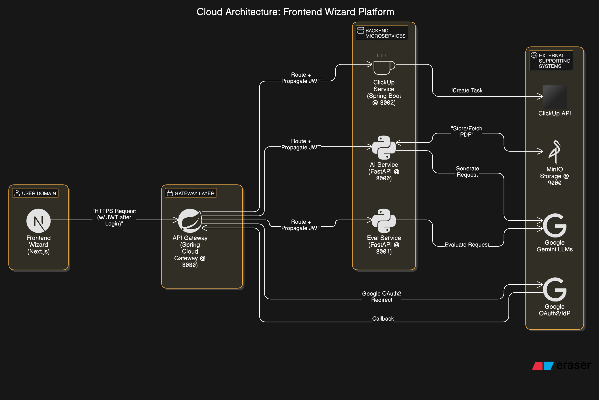

# AI Bot For ClickUp (POC v1.1)

**Version:** 1.1 (Includes Gateway Auth & Backend JWT Validation)
**Author:** Amir Abdallah
**Date:** 2024-MM-DD (Update with current date when finalizing)
**Status:** Core backend services and API Gateway implemented with authentication. Containerization and formal testing pending.

## Table of Contents

- [AI Bot For ClickUp (POC v1.1)](#ai-bot-for-clickup-poc-v11)
  - [Table of Contents](#table-of-contents)
  - [1. Introduction: Vision, Context, and User Flow](#1-introduction-vision-context-and-user-flow)
    - [1.1. Business Context \& Problem Statement](#11-business-context--problem-statement)
    - [1.2. Project Goal: "AI Bot For ClickUp"](#12-project-goal-ai-bot-for-clickup)
    - [1.3. Target Users](#13-target-users)
    - [1.4. Frontend Vision \& User Story Flow (Wizard)](#14-frontend-vision--user-story-flow-wizard)
  - [2. Technology Stack (High Level)](#2-technology-stack-high-level)
  - [3. System Architecture \& Design](#3-system-architecture--design)
    - [3.1. Microservice Overview](#31-microservice-overview)
    - [3.2. Role of API Gateway](#32-role-of-api-gateway)
    - [3.3. Authentication \& Authorization Flow](#33-authentication--authorization-flow)
    - [3.4. High-Level Code Structure Visualization](#34-high-level-code-structure-visualization)
  - [4. Detailed Sequence Flow (End-to-End Example)](#4-detailed-sequence-flow-end-to-end-example)
  - [5. API Contracts (View from API Gateway)](#5-api-contracts-view-from-api-gateway)
  - [6. API Interaction Examples (Based on Testing)](#6-api-interaction-examples-based-on-testing)
  - [7. Setup \& Running Instructions (Local Development)](#7-setup--running-instructions-local-development)
  - [8. Current Status \& Next Steps](#8-current-status--next-steps)

## 1. Introduction: Vision, Context, and User Flow

### 1.1. Business Context & Problem Statement

In many software development environments, translating detailed requirements, often captured in PDF documents, into actionable tasks within project management tools like ClickUp is a manual, time-consuming, and potentially error-prone process. This manual step can lead to inconsistencies, delays, and inefficient use of valuable personnel time (e.g., BAs, PMs, Dev Leads).

### 1.2. Project Goal: "AI Bot For ClickUp"

This project, **"AI Bot For ClickUp"**, is a Proof of Concept (POC) designed to drastically streamline this workflow. Its core goal is to **automate the creation of structured ClickUp tasks directly from software requirement PDF documents using Artificial Intelligence**, specifically Large Language Models (LLMs).

The vision is to provide an internal tool that:

-   **Ingests Requirement PDFs:** Allows users to easily upload documents.
-   **Generates Structured Tickets:** Uses AI (Google Gemini via LangChain) guided by user instructions (system prompts) to extract key information (title, description, acceptance criteria, priority) and format it as structured JSON.
-   **Evaluates AI Output:** Provides an AI-driven assessment of the generated JSON's quality and adherence to the user's prompt.
-   **Creates ClickUp Tasks:** Pushes the finalized (potentially user-edited) ticket data directly into a designated ClickUp list via the ClickUp API.
-   **Secure & Accessible:** Provides a secure web interface accessed via standard company authentication (Google OAuth 2.0).

### 1.3. Target Users

Internal team members involved in the software development lifecycle:

-   Business Analysts (BAs)
-   Product Managers (PMs)
-   Development Team Leads
-   Developers
-   QA Engineers

### 1.4. Frontend Vision & User Story Flow (Wizard)

The envisioned user interaction is through a clean, modern, **wizard-like web application (planned as Next.js)**, guiding the user step-by-step:

1.  **As a User, I want to land on a professional-looking page that explains the "AI Bot For ClickUp" purpose, so that I understand its value.**
    *   *AC:* Simple landing page exists.
    *   *AC:* A clear "Sign In / Get Started" button is present.
2.  **As a User, I want to securely sign in using my company Google account, so that the application knows who I am and I can access its features.**
    *   *AC:* Clicking "Sign In" initiates the Google OAuth 2.0 flow via the API Gateway.
    *   *AC:* Upon successful Google login, I am redirected back to the application's main functional interface (the start of the wizard).
3.  **As a User (authenticated), I want to upload or drag-and-drop a PDF requirement document, so that the system can process it.** (**Wizard Step 1**)
    *   *AC:* UI provides a clear upload area with constraints (PDF, size limit).
    *   *AC:* Frontend validates file type/size client-side.
    *   *AC:* Upload triggers `POST /gw/ai-service/api/v1/documents/upload/` (via Gateway).
    *   *AC:* Frontend receives and stores the `document_id` on success.
    *   *AC:* User receives clear feedback (uploading, success, error).
4.  **As a User, I want to provide specific instructions (a "system prompt") to guide the AI on how to extract information and structure the ticket JSON, so that the output meets my specific needs.** (**Wizard Step 2**)
    *   *AC:* UI provides a text area for the system prompt with examples/guidance.
    *   *AC:* Clicking "Generate Ticket" triggers `POST /gw/ai-service/api/v1/tickets/generate-from-document` (via Gateway) with `document_id` and `system_prompt`.
    *   *AC:* Frontend displays a loading state during AI processing.
    *   *AC:* Frontend receives and stores the `generated_json` and the `original_system_prompt`.
    *   *AC:* Frontend displays the `generated_json` in a readable, formatted way (read-only at this stage).
5.  **As a User, I want to optionally request an AI-driven evaluation of the generated ticket draft, so that I can gauge its quality and alignment with my prompt before creating it in ClickUp.** (**Wizard Step 3**)
    *   *AC:* UI displays the `generated_json` for context.
    *   *AC:* A clear "Evaluate Ticket Quality" button exists.
    *   *AC:* Clicking "Evaluate" triggers `POST /gw/eval-service/api/v1/evaluate/ticket` (via Gateway) with `generated_json` and `original_system_prompt`.
    *   *AC:* Frontend displays a loading state during evaluation.
    *   *AC:* Frontend receives and displays the `is_valid` (boolean, visual cues) and `evaluation_reasoning` (text) results.
6.  **As a User, I want to review the generated ticket data, make final edits if necessary, specify the target ClickUp list, and then create the task in ClickUp, so that the requirement becomes an actionable work item.** (**Wizard Step 4**)
    *   *AC:* UI displays the ticket data (`title`, `description`, `priority`) in **editable fields**, pre-populated from the `generated_json`.
    *   *AC:* UI provides a mechanism to input/select the target ClickUp **`listId`**.
    *   *AC:* User can modify the content in the editable fields.
    *   *AC:* Clicking "Create ClickUp Ticket" triggers `POST /gw/clickup-service/api/v1/create-ticket` (via Gateway) with the **final (potentially edited)** data and `listId`.
    *   *AC:* Frontend displays a loading state during ClickUp interaction.
    *   *AC:* Frontend receives confirmation (`task_id`, `url`) or error message.
    *   *AC:* Frontend displays success message with a link to the created ClickUp task, or a clear error message.

## 2. Technology Stack (High Level)

-   **Backend Frameworks:** FastAPI (Python 3.x), Spring Boot 3.x (Java 21)
-   **API Gateway:** Spring Cloud Gateway
-   **Security:** Spring Security (OAuth2 Client, OAuth2 Resource Server), JJWT, python-jose
-   **AI/LLM:** Google Gemini via LangChain (`langchain`, `langchain-google-genai`, `google-generativeai`)
-   **PDF Processing:** PyMuPDF (`fitz`)
-   **Object Storage:** MinIO (S3 Compatible)
-   **Database:** None currently required by services (stateless focus)
-   **Containerization:** Docker, Docker Compose
-   **Frontend (Planned):** Next.js / React

## 3. System Architecture & Design

### 3.1. Microservice Overview

The backend consists of four distinct microservices orchestrated via an API Gateway:

1.  **`api-gateway-service`**: The single entry point for the frontend. Handles authentication, routing, CORS, JWT issuance/propagation. (Spring Cloud Gateway)
2.  **`ai-service`**: Handles PDF ingestion, storage, text extraction, and primary LLM generation of JSON tickets. Validates JWTs. (FastAPI)
3.  **`eval-service`**: Handles LLM-based evaluation of the generated JSON ticket quality. Validates JWTs. (FastAPI)
4.  **`clickup-ticket-service`**: Handles interaction with the ClickUp API to create tasks. Validates JWTs. (Spring Boot)

**Supporting Infrastructure:**

-   **MinIO**: Stores uploaded PDFs. Accessed only by `ai-service`.
-   **Google Cloud Platform**: Hosts Google OAuth 2.0 Credentials and Gemini LLM APIs.
-   **ClickUp API**: External API accessed by `clickup-ticket-service`.

**(Conceptual Diagram)**



### 3.2. Role of API Gateway

-   **Single Entry Point:** All frontend requests target the Gateway.
-   **Authentication:** Handles Google OAuth 2.0 login flow, becoming the OAuth2 Client.
-   **JWT Issuance:** Issues custom JWTs upon successful user authentication.
-   **JWT Propagation:** Forwards the JWT in the `Authorization: Bearer` header to backend services using a custom filter (`ForwardAuthHeaderFilter`).
-   **Routing:** Maps external paths (e.g., `/gw/ai-service/...`) to internal service URLs (`http://ai-service:8000/...`) using path predicates and `StripPrefix`. Configured via `application.yml`.
-   **CORS:** Central point for managing Cross-Origin Resource Sharing policies (pending config).
-   **Security Layer:** Acts as the primary security enforcement point before requests reach backend services.

### 3.3. Authentication & Authorization Flow

1.  **Login:** User hits Gateway -> Redirect to Google -> User authenticates -> Google redirects to Gateway callback -> Gateway validates code, gets user info, issues JWT -> Gateway redirects to Frontend URL with JWT in fragment (`#access_token=...`).
2.  **Frontend Stores JWT:** Frontend JS extracts JWT from fragment, stores it (e.g., localStorage).
3.  **API Calls:** Frontend sends JWT in `Authorization: Bearer <JWT>` header for all subsequent requests to the Gateway.
4.  **Gateway Processing:** Gateway receives request. Spring Security (configured as Resource Server) validates the incoming JWT (signature, expiry, issuer using shared secret). If valid, request proceeds.
5.  **JWT Forwarding:** `ForwardAuthHeaderFilter` copies the `Authorization: Bearer <JWT>` header to the request proxied to the backend service.
6.  **Backend Validation:** Each backend service (`ai-service`, `eval-service`, `clickup-ticket-service`) independently validates the received JWT using the shared secret and configuration (issuer, algorithm) via its own security setup (FastAPI dependency or Spring Security Resource Server).
7.  **Processing:** If the backend validates the JWT, it processes the request. Otherwise, it returns a 401 Unauthorized.

### 3.4. High-Level Code Structure Visualization

This project is structured as a monorepo with distinct services:

```plaintext
📁 PFE-EVAL
├── 🧠 ai-service/             # FastAPI service for AI processing & PDF handling
│   ├── app/                  # Main application code
│   │   ├── api_v1/           # Version 1 API (endpoints, routers)
│   │   ├── core/             # Core logic (config, security, dependencies)
│   │   ├── schemas/          # Pydantic models for request/response
│   │   └── services/         # Business logic (LLM, PDF, storage)
│   ├── tests/
│   ├── .env                  # Environment variables (INCLUDED IN GIT FOR POC)
│   ├── docker-compose.yml    # Docker compose for this service (if standalone)
│   └── requirements.txt
├── 🌐 api-gateway-service/   # Spring Cloud Gateway
│   ├── src/main/java/...     # Java source code
│   │   ├── config/           # Security, JWT properties
│   │   ├── controller/       # User info endpoint
│   │   ├── filter/           # JWT forwarding filter
│   │   └── security/         # OAuth2 success handler, JWT provider
│   ├── src/main/resources/application.yml # Gateway configuration
│   └── pom.xml
├── 🎫 clickup-ticket-service/ # Spring Boot service for ClickUp integration
│   ├── src/main/java/...     # Java source code
│   │   ├── client/           # ClickUp API client
│   │   ├── config/           # App, Security, WebClient config
│   │   ├── controller/       # API endpoints
│   │   ├── dto/              # Data Transfer Objects
│   │   └── service/          # Business logic
│   ├── src/main/resources/application.yml # Service configuration
│   └── pom.xml
├── 📊 eval-service/          # FastAPI service for evaluating AI output
│   ├── app/                  # Similar structure to ai-service
│   │   ├── api_v1/
│   │   ├── core/
│   │   ├── schemas/
│   │   └── services/
│   ├── tests/
│   ├── .env                  # Environment variables (INCLUDED IN GIT FOR POC)
│   └── requirements.txt
├── 💻 front-end/             # Next.js frontend (planned)
├── 📄 .gitignore
├── 📄 README.md               <-- You are here
└── 🐳 docker-compose.yml      # (Planned) Root docker-compose for all services
```

Key responsibility areas:
-   **`config` / `core.config`:** Service-specific configurations, loading environment variables, API keys.
-   **`security` / `core.security`:** JWT validation logic (in backend services), JWT generation/OAuth handling (in gateway).
-   **`filter` (gateway):** Modifying requests/responses, e.g., `ForwardAuthHeaderFilter`.
-   **`services` (FastAPI) / `service` (Spring Boot):** Core business logic for each microservice.
-   **`endpoints` / `controller`:** API route definitions and request handling.

## 4. Detailed Sequence Flow (End-to-End Example)

1.  **User** -> **Frontend**: Initiates Login.
2.  **Frontend** -> **API Gateway** (`/oauth2/authorization/google`): Starts login flow.
3.  **API Gateway** <-> **Google**: Handles OAuth2 redirects, user login, code exchange.
4.  **API Gateway** -> **Frontend** (`/auth/callback#access_token=<JWT>`): Redirects with JWT after successful Google auth.
5.  **Frontend**: Stores JWT. Presents Wizard Step 1.
6.  **User** -> **Frontend**: Uploads PDF.
7.  **Frontend** (with JWT) -> **API Gateway** (`POST /gw/ai-service/api/v1/documents/upload/`) -> **AI Service**: Gateway validates JWT, forwards. AI Service validates JWT, stores PDF in MinIO, returns `document_id`. -> **Frontend**: Stores `document_id`. Presents Wizard Step 2.
8.  **User** -> **Frontend**: Enters System Prompt. Clicks "Generate".
9.  **Frontend** (with JWT) -> **API Gateway** (`POST /gw/ai-service/api/v1/tickets/generate-from-document`) -> **AI Service**: Gateway validates JWT, forwards. AI Service validates JWT, fetches PDF from MinIO, extracts text, calls LLM1 (Gemini), parses/validates response, returns `generated_json`. -> **Frontend**: Stores `generated_json`, `original_system_prompt`. Presents Wizard Step 3.
10. **User** -> **Frontend**: Clicks "Evaluate".
11. **Frontend** (with JWT) -> **API Gateway** (`POST /gw/eval-service/api/v1/evaluate/ticket`) -> **Eval Service**: Gateway validates JWT, forwards. Eval Service validates JWT, calls LLM2 (Gemini) with internal prompt + data, parses response, returns `is_valid`, `reasoning`. -> **Frontend**: Displays evaluation. Presents Wizard Step 4.
12. **User** -> **Frontend**: Reviews/Edits ticket data, enters ClickUp `listId`, clicks "Create Ticket".
13. **Frontend** (with JWT) -> **API Gateway** (`POST /gw/clickup-service/api/v1/create-ticket`) -> **ClickUp Ticket Service**: Gateway validates JWT, forwards. ClickUp Ticket Service validates JWT, calls ClickUp API, returns `task_id`, `url`. -> **Frontend**: Displays success/error with ClickUp link.

## 5. API Contracts (View from API Gateway)

**Base URL (Gateway):** `http://localhost:8080` (Local Dev)

-   **Authentication:** All endpoints below (except `/health` or public gateway paths like `/oauth2/**`) require a valid `Authorization: Bearer <JWT>` header obtained after Google Login.
-   **AI Service Routes:**
    -   `POST /gw/ai-service/api/v1/documents/upload/`: Upload PDF (multipart/form-data). Returns `DocumentUploadResponse`.
    -   `POST /gw/ai-service/api/v1/tickets/generate-from-document`: Generate ticket (JSON body: `TicketGenerateRequest`). Returns `TicketGenerateResponse`.
    -   `GET /gw/ai-service/health`: Health check. Returns `{"status": "ok", ...}`.
-   **Eval Service Routes:**
    -   `POST /gw/eval-service/api/v1/evaluate/ticket`: Evaluate ticket (JSON body: `EvaluateTicketRequest`). Returns `EvaluateTicketResponse`.
    -   `GET /gw/eval-service/health`: Health check. Returns `{"status": "ok", ...}`.
-   **ClickUp Service Routes:**
    -   `POST /gw/clickup-service/api/v1/create-ticket`: Create ClickUp task (JSON body: `ClickUpTicketRequest`). Returns `ClickUpTaskResponse`.
    -   `GET /gw/clickup-service/api/v1/health`: Health check. Returns `{"status": "UP"}`.
-   **Gateway Endpoints:**
    -   `GET /oauth2/authorization/google`: Initiates Google Login.
    -   `GET /login/oauth2/code/google`: Callback URL for Google (handled by Spring Security).
    -   `GET /gw/me`: Returns authenticated user's attributes (from Google).

## 6. API Interaction Examples (Based on Testing)

1.  **Obtain JWT:**
    *   User navigates to a frontend page that has a "Login with Google" button.
    *   This button links to `http://localhost:8080/oauth2/authorization/google`.
    *   User authenticates with Google.
    *   Google redirects to `http://localhost:8080/login/oauth2/code/google?...`.
    *   API Gateway handles this, exchanges code for tokens, gets user info, issues its own JWT.
    *   API Gateway redirects to frontend (e.g., `http://localhost:3000/auth/callback#access_token=eyJhbGciOiJIUzUxMiJ9...`).
    *   Frontend JavaScript extracts the JWT from the URL fragment.
2.  **Upload PDF (Requires JWT):**
    ```bash
    POST http://localhost:8080/gw/ai-service/api/v1/documents/upload/
    Authorization: Bearer <COPIED_JWT_FROM_STEP_1>
    Content-Type: multipart/form-data

    <@ ./path/to/your/requirement.pdf
    ```
    *   **Response (201):** `{"document_id": "b816e...", "filename": "requirement.pdf", ...}`
3.  **Generate Ticket (Requires JWT):**
    ```bash
    POST http://localhost:8080/gw/ai-service/api/v1/tickets/generate-from-document
    Authorization: Bearer <COPIED_JWT_FROM_STEP_1>
    Content-Type: application/json

    {
      "document_id": "b816e...",
      "system_prompt": "Extract title, description, and acceptance criteria for user stories. Prioritize based on keywords like 'must-have'."
    }
    ```
    *   **Response (200):** `{"generated_json": {"title": "Email/Password Login", ...}, ...}`
4.  **Evaluate Ticket (Requires JWT):**
    ```bash
    POST http://localhost:8080/gw/eval-service/api/v1/evaluate/ticket
    Authorization: Bearer <COPIED_JWT_FROM_STEP_1>
    Content-Type: application/json

    {
      "generated_json": {
        "title": "Email/Password Login",
        "description": "User should be able to log in.",
        "priority": "High",
        "acceptance_criteria": ["AC1", "AC2"]
      },
      "original_system_prompt": "Extract title, description, and acceptance criteria for user stories. Prioritize based on keywords like 'must-have'."
    }
    ```
    *   **Response (200):** `{"is_valid": true, "evaluation_reasoning": "The JSON adheres to the prompt by extracting all requested fields..."}`
5.  **Create ClickUp Ticket (Requires JWT):**
    ```bash
    POST http://localhost:8080/gw/clickup-service/api/v1/create-ticket
    Authorization: Bearer <COPIED_JWT_FROM_STEP_1>
    Content-Type: application/json

    {
      "name": "Email/Password Login",
      "description": "User should be able to log in.\n\nAcceptance Criteria:\n- AC1\n- AC2",
      "priority": 1,
      "listId": "YOUR_CLICKUP_LIST_ID"
    }
    ```
    *   **Response (201):** `{"message": "Ticket created successfully in ClickUp.", "task_id": "86990352y", "task_url": "https://app.clickup.com/t/86990352y"}`

## 7. Setup & Running Instructions (Local Development)

> **⚠️ WARNING ON SECRETS:** This POC setup, as per request, involves committing `.env` files with API keys directly into the repository. This is **NOT recommended for production or any shared environment beyond this specific POC context**. In a real-world scenario, use environment variables provided by your hosting platform, a secrets manager, or load them from unversioned files at runtime.

1.  **Prerequisites:**
    *   Git
    *   Docker & Docker Compose
    *   Java 21 & Maven
    *   Python 3.8+ (preferably 3.10+ for newer features, ensure `venv` is available)
    *   Access to Google Cloud Console (for OAuth 2.0 Client ID & Secret, and Gemini API Key)
    *   ClickUp Account (for API Key and a target List ID)
    *   `pnpm` or `npm`/`yarn` for the (planned) Next.js frontend.

2.  **Clone the Repository (Once it's on GitHub):**
    ```bash
    git clone <your-github-repo-url>
    cd PFE-EVAL
    ```

3.  **Configuration:**
    *   **Root `.env` (for Docker Compose - Create this if not present):**
        Create a `.env` file in the `PFE-EVAL` root directory. This will be used by the main `docker-compose.yml` (when you create it for orchestrating all services).
        ```env
        # PFE-EVAL/.env
        JWT_SECRET_KEY=YourSuperSecretKeyForJWTsThatIsAtLeast512BitsLongAndRandom # CHANGE THIS!
        GOOGLE_CLIENT_ID=your-google-client-id.apps.googleusercontent.com
        GOOGLE_CLIENT_SECRET=your-google-client-secret
        CLICKUP_API_KEY=pk_your_clickup_api_key
        AI_GOOGLE_API_KEY=your_gemini_api_key_for_ai_service
        EVAL_GOOGLE_API_KEY=your_gemini_api_key_for_eval_service # Can be the same as AI_GOOGLE_API_KEY
        
        # MinIO Credentials (if not using default from a shared MinIO compose file)
        MINIO_ROOT_USER=minioadmin
        MINIO_ROOT_PASSWORD=minioadmin
        MINIO_BUCKET_NAME=pdf-documents # Ensure this matches ai-service config

        # Gateway Config
        GATEWAY_PORT=8080
        FRONTEND_REDIRECT_URI=http://localhost:3000/auth/callback # Adjust if your frontend runs elsewhere

        # Service Ports (if needed to be configurable, defaults usually fine)
        AI_SERVICE_PORT=8000
        EVAL_SERVICE_PORT=8001
        CLICKUP_SERVICE_PORT=8002
        ```
    *   **`ai-service/.env`:** Ensure this file exists in `PFE-EVAL/ai-service/` and contains:
        ```env
        # PFE-EVAL/ai-service/.env
        GOOGLE_API_KEY=${AI_GOOGLE_API_KEY} # Can be set directly or inherited from root .env via Docker Compose
        JWT_SECRET_KEY=${JWT_SECRET_KEY}    # Can be set directly or inherited
        JWT_ALGORITHM=HS512
        MINIO_ENDPOINT=minio:9000
        MINIO_ACCESS_KEY=${MINIO_ROOT_USER} # Or specific MinIO user for this service
        MINIO_SECRET_KEY=${MINIO_ROOT_PASSWORD} # Or specific MinIO secret for this service
        MINIO_BUCKET_NAME=${MINIO_BUCKET_NAME}
        MINIO_SECURE=False # True if MinIO is using HTTPS
        ```
    *   **`eval-service/.env`:** Ensure this file exists in `PFE-EVAL/eval-service/` and contains:
        ```env
        # PFE-EVAL/eval-service/.env
        GOOGLE_API_KEY=${EVAL_GOOGLE_API_KEY}
        JWT_SECRET_KEY=${JWT_SECRET_KEY}
        JWT_ALGORITHM=HS512
        ```
    *   **`api-gateway-service/src/main/resources/application.yml`:**
        Verify it correctly references environment variables for secrets:
        ```yaml
        # Example snippets
        spring:
          security:
            oauth2:
              client:
                registration:
                  google:
                    client-id: ${GOOGLE_CLIENT_ID}
                    client-secret: ${GOOGLE_CLIENT_SECRET}
                    # ... other google settings
        # ...
        app:
          jwt:
            secret-key: ${JWT_SECRET_KEY} # Used for issuing JWTs
            # ... other jwt settings
          frontend-redirect-uri: ${FRONTEND_REDIRECT_URI:http://localhost:3000/auth/callback} # Default if var not set
        
        # Example route for ai-service
        # spring.cloud.gateway.routes:
        # - id: ai-service
        #   uri: lb://ai-service # if using service discovery like Eureka
        #   # OR
        #   # uri: http://ai-service:${AI_SERVICE_PORT:8000} # For Docker Compose network
        #   # OR for local non-containerized dev:
        #   # uri: http://localhost:8000
        #   predicates:
        #   - Path=/gw/ai-service/**
        #   filters:
        #   - StripPrefix=2
        #   - name: ForwardAuthHeaderFilter
        ```
    *   **`clickup-ticket-service/src/main/resources/application.yml`:**
        Verify it correctly references environment variables:
        ```yaml
        # Example snippets
        clickup:
          api:
            key: ${CLICKUP_API_KEY}
            base-url: "https://api.clickup.com/api/v2"
        # ...
        app:
          jwt:
            secret-key: ${JWT_SECRET_KEY} # Used for validating JWTs
        # ...
        ```
    *   **Google Cloud Console:**
        *   Ensure your OAuth 2.0 Client has `http://localhost:8080/login/oauth2/code/google` (or your gateway's equivalent callback) added to "Authorized redirect URIs".
    *   **ClickUp:**
        *   Note your API Key and the ID of the List where tasks should be created. The `listId` will typically be sent by the frontend with each "Create Ticket" request, or you can hardcode a default in `clickup-ticket-service` for testing.

4.  **Run MinIO (Example using Docker):**
    If you don't have a central `docker-compose.yml` for all services yet, you can run MinIO standalone:
    ```bash
    docker run -d -p 9000:9000 -p 9001:9001 \
      --name minio-dev \
      -e "MINIO_ROOT_USER=${MINIO_ROOT_USER:-minioadmin}" \
      -e "MINIO_ROOT_PASSWORD=${MINIO_ROOT_PASSWORD:-minioadmin}" \
      quay.io/minio/minio server /data --console-address ":9001"
    ```
    Access MinIO Console (`http://localhost:9001`), log in, and **create the bucket** (e.g., `pdf-documents`) specified in your `ai-service` configuration.

5.  **Run Backend Services (Manual Startup - Current State):**
    Open separate terminals for each service. Navigate to their respective directories.

    *   **API Gateway Service (`api-gateway-service`):**
        ```bash
        cd PFE-EVAL/api-gateway-service
        # Ensure GOOGLE_CLIENT_ID, GOOGLE_CLIENT_SECRET, JWT_SECRET_KEY are set as env vars 
        # or available via Spring Boot's externalized config (e.g., root .env if supported by run)
        mvn spring-boot:run 
        ```
    *   **AI Service (`ai-service`):**
        ```bash
        cd PFE-EVAL/ai-service
        python -m venv venv
        source venv/bin/activate # On Windows: venv\Scripts\activate
        pip install -r requirements.txt
        # Ensure .env file is populated or env vars (GOOGLE_API_KEY, JWT_SECRET_KEY, MINIO_*) are set
        uvicorn app.main:app --host 0.0.0.0 --port 8000 --reload 
        ```
    *   **Eval Service (`eval-service`):**
        ```bash
        cd PFE-EVAL/eval-service
        python -m venv venv
        source venv/bin/activate # On Windows: venv\Scripts\activate
        pip install -r requirements.txt
        # Ensure .env file is populated or env vars (GOOGLE_API_KEY, JWT_SECRET_KEY) are set
        uvicorn app.main:app --host 0.0.0.0 --port 8001 --reload
        ```
    *   **ClickUp Ticket Service (`clickup-ticket-service`):**
        ```bash
        cd PFE-EVAL/clickup-ticket-service
        # Ensure CLICKUP_API_KEY, JWT_SECRET_KEY are set as env vars 
        # or available via Spring Boot's externalized config
        mvn spring-boot:run
        ```

6.  **(Future State - Docker Compose for All Services):**
    You will create a root `PFE-EVAL/docker-compose.yml` and `Dockerfile`s for each service.
    Then, from the `PFE-EVAL` root:
    ```bash
    docker-compose up --build -d
    ```

## 8. Current Status & Next Steps

-   **Status:**
    -   Core functionality of all 4 backend services (`ai-service`, `eval-service`, `clickup-ticket-service`, `api-gateway-service`) is implemented.
    -   API Gateway handles Google OAuth 2.0 login and issues JWTs.
    -   JWT Propagation from Gateway to Backend Services is implemented via `ForwardAuthHeaderFilter`.
    -   JWT Validation using the shared secret is implemented and tested successfully for all 3 backend services.
    -   Individual service APIs and the integrated flow (up to ClickUp creation) have been tested successfully via Postman/Insomnia through the gateway using a valid JWT.
    -   The foundational backend and security architecture is complete for the POC.
-   **Immediate Next Steps (Chunk 6 & Frontend):**
    1.  **CORS Configuration:** Implement CORS on the `api-gateway-service` to allow requests from the frontend origin (e.g., `http://localhost:3000`). **(High Priority for Frontend)**
    2.  **Dockerfiles:** Create optimized `Dockerfile`s for `api-gateway-service`, `eval-service`, and `clickup-ticket-service`. (`ai-service` might already have one in its `docker-compose.yml`).
    3.  **Root Docker Compose:** Create/Update the root `PFE-EVAL/docker-compose.yml` to build and orchestrate all containers (`minio`, `ai-service`, `eval-service`, `clickup-ticket-service`, `api-gateway-service`) with correct networking, port mapping, and environment variable injection from the root `.env` file.
    4.  **Containerized E2E Testing:** Run the full stack via `docker-compose up` and repeat the Insomnia/Postman test suite against the gateway port (e.g., `localhost:8080`) to ensure everything works within the containerized environment. Debug networking/env var issues as needed.
    5.  **Frontend Development:**
        *   Navigate to `PFE-EVAL/front-end`.
        *   If not already initialized: `pnpm create next-app@latest .` (or `npx create-next-app@latest .`)
        *   Begin building the Next.js wizard application based on the UI/UX requirements, integrating with the API Gateway endpoints.
        *   The frontend will need to handle the OAuth callback (e.g., on `/auth/callback`), extract the JWT from the URL fragment (`#access_token=...`), store it securely (e.g., HttpOnly cookie managed by a backend-for-frontend endpoint, or in memory; localStorage is common but has XSS risks), and include it in `Authorization: Bearer <JWT>` headers for API calls.
    6.  **Refinement & Testing:** Continue refining LLM prompts, adding more robust error handling, and planning for formal unit/integration tests for each service.

---

This `README.md` should give a comprehensive overview of your project on GitHub.
Remember to replace placeholders like `<your-github-repo-url>` and ensure API keys in `.env` files are correctly set up for your local development.
